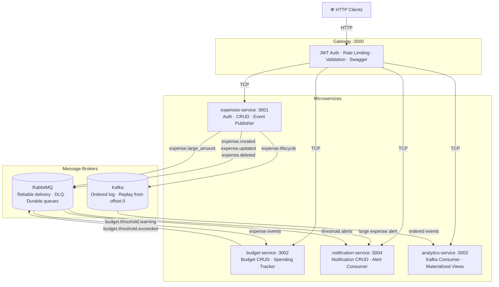
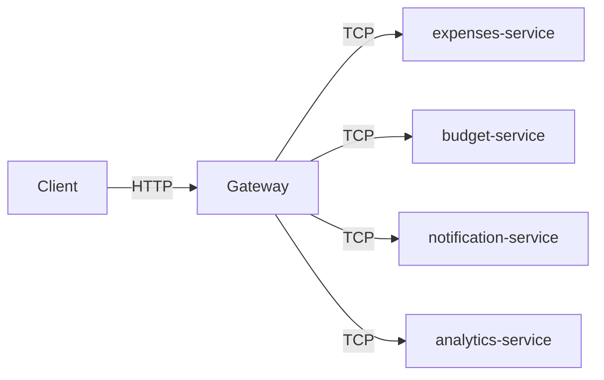
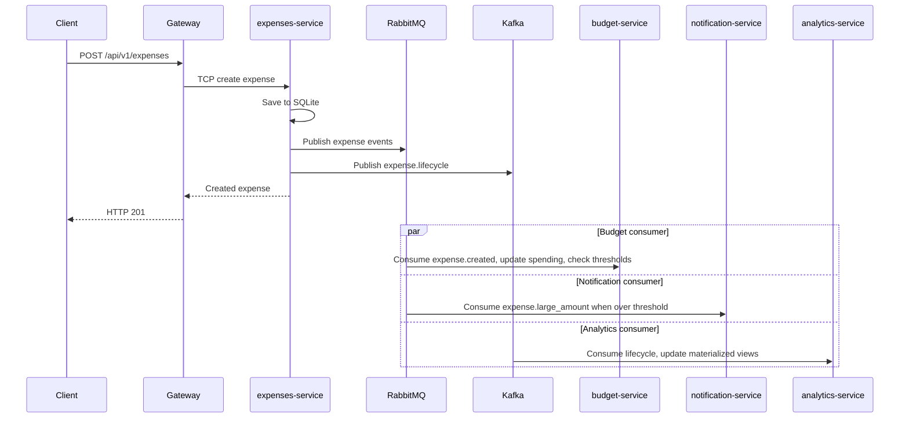
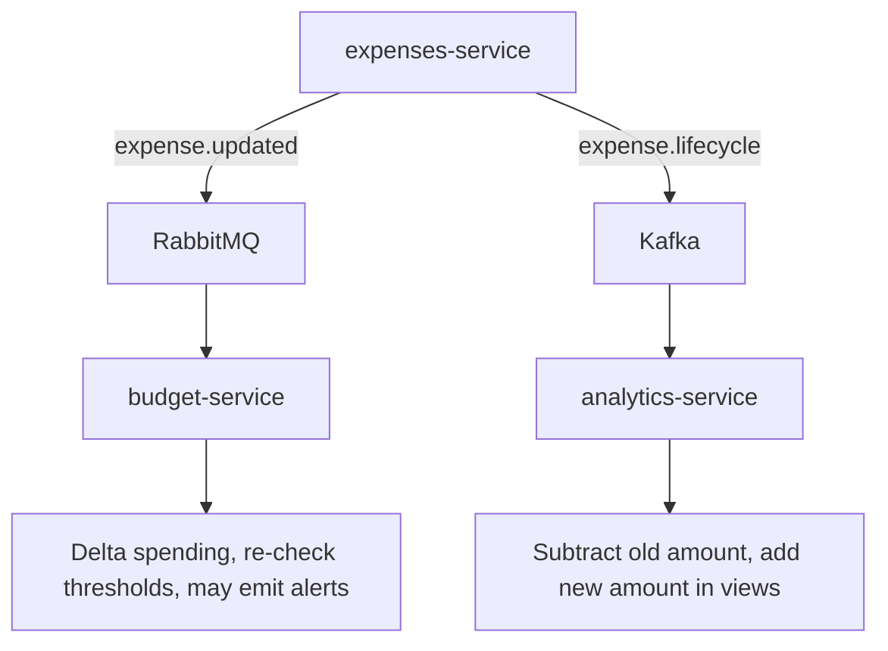
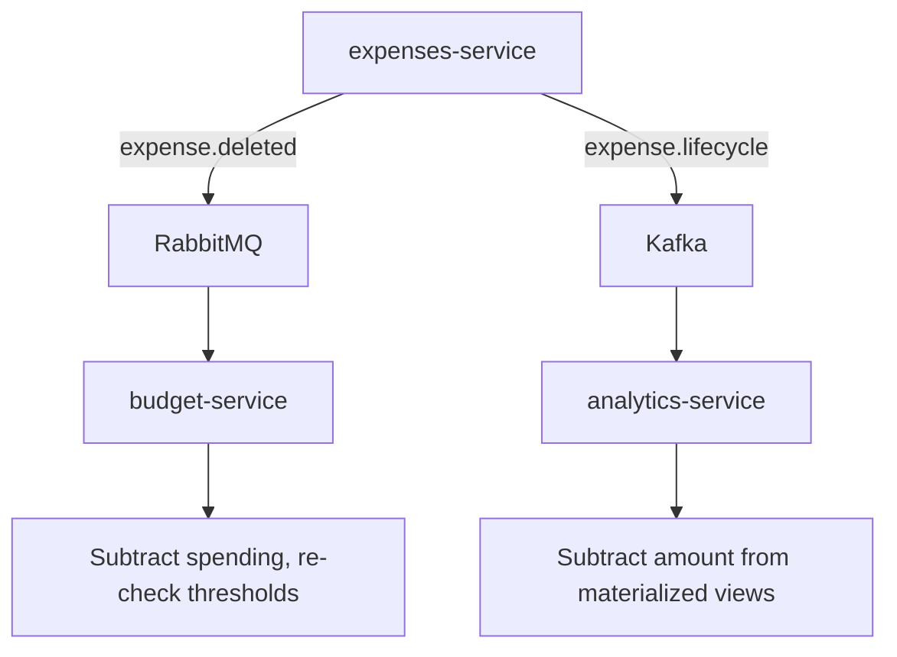
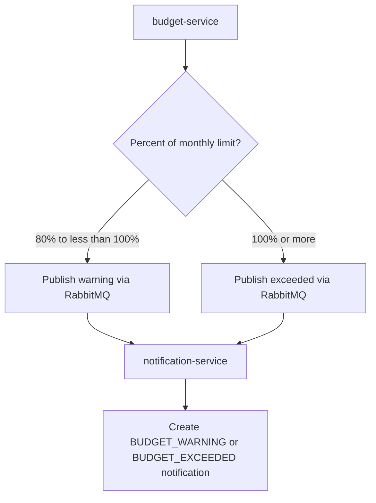
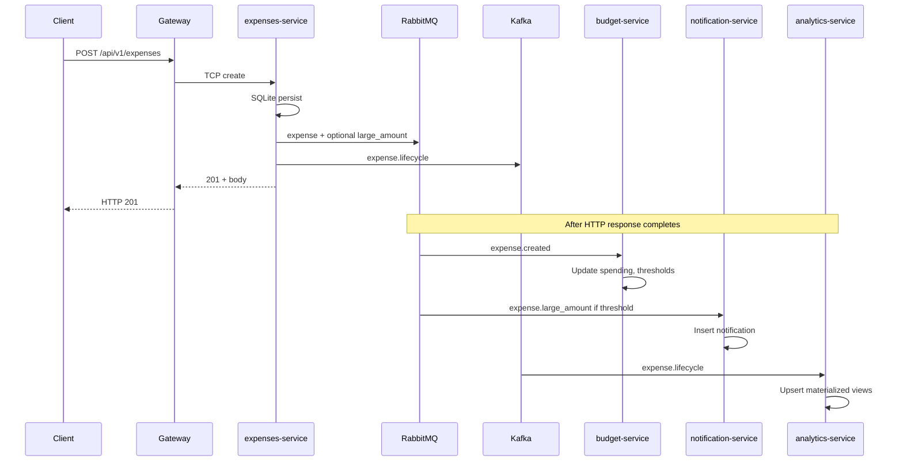

# Expense Tracker — NestJS Microservices Monorepo

A full-featured expense tracking platform built with **NestJS**, demonstrating microservices architecture with **three distinct transport mechanisms** — each chosen for a genuine architectural reason.

---

## Table of Contents

- [Architecture Overview](#architecture-overview)
- [Transport Strategy](#transport-strategy)
- [Service Descriptions](#service-descriptions)
- [Communication Flow Graph](#communication-flow-graph)
  - [How to read these diagrams](#how-to-read-these-diagrams)
  - [Synchronous flows](#synchronous-flows)
  - [Flow 1: Expense created](#flow-1-expense-created)
  - [Flow 2: Expense updated](#flow-2-expense-updated)
  - [Flow 3: Expense deleted](#flow-3-expense-deleted)
  - [Flow 4: Budget threshold crossed](#flow-4-budget-threshold-crossed)
  - [Full event chain example](#full-event-chain-example)
- [API Endpoints](#api-endpoints)
- [Event Flows](#event-flows)
- [Data Models](#data-models)
- [Database Schemas](#database-schemas)
- [Shared Package](#shared-package)
- [Configuration & Environment](#configuration--environment)
- [Infrastructure (Docker Compose)](#infrastructure-docker-compose)
- [Design Principles](#design-principles)
- [Getting Started](#getting-started)

---

## Architecture Overview

Synchronous calls use **TCP** from the gateway to each microservice. **RabbitMQ** and **Kafka** carry async messages; exact pattern and queue names are in [Event Flows](#event-flows).




---

## Transport Strategy

Each transport is chosen for a specific architectural reason — not just to demonstrate variety.


| Transport    | Where Used                                              | Why                                                                                                                                                                                                                                                                                                                                    |
| ------------ | ------------------------------------------------------- | -------------------------------------------------------------------------------------------------------------------------------------------------------------------------------------------------------------------------------------------------------------------------------------------------------------------------------------- |
| **TCP**      | Gateway ↔ all microservices                             | Synchronous request/response. The gateway needs immediate answers to serve HTTP clients. TCP is NestJS's lightest RPC transport — no broker overhead, minimal latency.                                                                                                                                                                 |
| **RabbitMQ** | expenses-service → budget-service, notification-service | Reliable async work queues. Budget checks and notifications are **side effects** that must not block expense creation. RabbitMQ provides guaranteed delivery (ack/nack), dead-letter queues for failed messages, and durable queues that survive broker restarts.                                                                      |
| **Kafka**    | expenses-service → analytics-service                    | Ordered event log with replay. Analytics needs the **complete history** of expense events to build materialized views. Kafka retains events indefinitely — if analytics-service crashes or a new consumer joins, it can replay from offset 0 to rebuild its state. Multiple consumers read independently without affecting each other. |


---

## Service Descriptions

### Gateway (HTTP :3000)

The **public-facing API** and the only service exposed to clients. All other services are internal.

**Responsibilities:**

- HTTP routing, Swagger documentation
- JWT authentication (secure-by-default — all routes require auth unless `@Public()`)
- Rate limiting (configurable TTL/limit per IP via `@nestjs/throttler`)
- Request validation (whitelist + transform via global `ValidationPipe`)
- Response wrapping (consistent `{ data, meta? }` envelope via `TransformInterceptor`)
- Proxies requests to microservices over TCP

### expenses-service (TCP :3001)

The **core domain** — expense CRUD, user authentication, and the **event publisher** that drives the entire async ecosystem.

**Responsibilities:**

- User registration, login, JWT issuance + refresh token rotation
- Expense CRUD with ownership enforcement
- Expense summary aggregation (by category and date range)
- **Event emission**: publishes every expense mutation to both RabbitMQ (for immediate side effects) and Kafka (for the analytics event log)
- Large expense detection: emits `expense.large_amount` when amount exceeds configurable threshold (default $500)

### budget-service (TCP :3002 + RabbitMQ consumer)

**Hybrid app** — listens on TCP for gateway queries and on RabbitMQ for expense events.

**Responsibilities:**

- Budget CRUD — users set monthly spending limits per category (or an overall limit)
- Budget status — spent vs. limit for any month, with percentage and warning flags
- **Async spending tracker**: consumes expense events from RabbitMQ, updates the `budget_spending` table
- **Threshold alerts**: when spending crosses 80% (warning) or 100% (exceeded), emits alert events to RabbitMQ for the notification-service

### notification-service (TCP :3004 + RabbitMQ consumer)

**Hybrid app** — listens on TCP for gateway queries and on RabbitMQ for alert events.

**Responsibilities:**

- Consumes budget threshold alerts and large expense events from RabbitMQ
- Creates human-readable notification records (title, message, type, metadata)
- Serves paginated notification list, unread count, mark-as-read
- "Sending" = writing to DB + logging (no real email/SMS — this is a learning project)

### analytics-service (TCP :3003 + Kafka consumer)

**Hybrid app** — listens on TCP for gateway queries and on Kafka for the expense event stream.

**Responsibilities:**

- Consumes the `expense.lifecycle` Kafka topic to build **materialized views** (`daily_spending`, `monthly_spending`)
- Spending trends: monthly totals across 1–24 months with category breakdowns
- Category breakdown: percentage distribution for a given month
- Anomaly detection: flags categories where current month spending exceeds the 3-month rolling average by more than 30%

---

## Communication Flow Graph

### How to read these diagrams

Diagrams here are **high-level**. The **authoritative** list of RabbitMQ patterns, queue names, and the Kafka topic is in [Event Flows](#event-flows).

### Synchronous flows

TCP **request/response**: every API call follows this pattern: the gateway receives an HTTP request, extracts the JWT payload, and forwards a TCP message to the responsible microservice. The microservice processes the request and returns the result synchronously.




### Asynchronous flows (RabbitMQ + Kafka)

#### Flow 1: Expense created




#### Flow 2: Expense updated




#### Flow 3: Expense deleted




#### Flow 4: Budget threshold crossed

After budget-service processes an expense event, it may publish threshold alerts (see [Event Flows](#event-flows) for pattern names).




### Full event chain example

Complete chain triggered by a single `POST /api/v1/expenses` request:

1. Client sends `POST /api/v1/expenses` with body (e.g. `amountCents: 60000`, `category: "FOOD"`).
2. Gateway validates JWT and body, forwards via TCP to expenses-service.
3. expenses-service saves the expense to SQLite.
4. expenses-service publishes to RabbitMQ (budget + notification queues as applicable) and to Kafka `expense.lifecycle` (see [Event Flows](#event-flows)).
5. expenses-service returns the created expense to the gateway → client (HTTP 201).
6. **[ASYNC]** budget-service consumes `expense.created`: updates `budget_spending`, checks thresholds (example: 75% of limit → no alert), ACKs the message.
7. **[ASYNC]** notification-service consumes `expense.large_amount` when over threshold: creates a large-expense notification, ACKs.
8. **[ASYNC]** analytics-service consumes `expense.lifecycle`: upserts `daily_spending` / `monthly_spending`, commits Kafka offset.
9. Later, `GET /api/v1/notifications` returns the large-expense alert (when applicable).
10. Later, `GET /api/v1/analytics/trends?months=6` reflects updated totals.




---

## API Endpoints

### Auth (`/api/v1/auth`) — Public


| Method | Path        | Description          | Body / Query          |
| ------ | ----------- | -------------------- | --------------------- |
| POST   | `/register` | Register new user    | `{ email, password }` |
| POST   | `/login`    | Login                | `{ email, password }` |
| POST   | `/refresh`  | Refresh access token | `{ refreshToken }`    |


### Expenses (`/api/v1/expenses`) — Authenticated


| Method | Path       | Description                     | Body / Query                                                  |
| ------ | ---------- | ------------------------------- | ------------------------------------------------------------- |
| POST   | `/`        | Create expense                  | `{ amountCents, currency, category, description, date }`      |
| GET    | `/`        | List expenses (paginated)       | `?category&from&to&page&limit`                                |
| GET    | `/summary` | Category summary for date range | `?from&to`                                                    |
| GET    | `/:id`     | Get single expense              | —                                                             |
| PATCH  | `/:id`     | Update expense                  | `{ amountCents?, currency?, category?, description?, date? }` |
| DELETE | `/:id`     | Delete expense                  | —                                                             |


### Budgets (`/api/v1/budgets`) — Authenticated


| Method | Path      | Description         | Body / Query                                  |
| ------ | --------- | ------------------- | --------------------------------------------- |
| POST   | `/`       | Create budget       | `{ category?, monthlyLimitCents, currency? }` |
| GET    | `/`       | List all budgets    | —                                             |
| GET    | `/status` | Spending vs. limit  | `?month=YYYY-MM`                              |
| PATCH  | `/:id`    | Update budget limit | `{ monthlyLimitCents }`                       |
| DELETE | `/:id`    | Delete budget       | —                                             |


### Notifications (`/api/v1/notifications`) — Authenticated


| Method | Path            | Description                    | Body / Query             |
| ------ | --------------- | ------------------------------ | ------------------------ |
| GET    | `/`             | List notifications (paginated) | `?page&limit&unreadOnly` |
| GET    | `/unread-count` | Unread badge count             | —                        |
| PATCH  | `/read-all`     | Mark all as read               | —                        |
| PATCH  | `/:id/read`     | Mark one as read               | —                        |


### Analytics (`/api/v1/analytics`) — Authenticated


| Method | Path         | Description                  | Body / Query       |
| ------ | ------------ | ---------------------------- | ------------------ |
| GET    | `/trends`    | Monthly spending time series | `?months=6` (1–24) |
| GET    | `/breakdown` | Category % breakdown         | `?month=YYYY-MM`   |
| GET    | `/anomalies` | Current month anomaly flags  | —                  |


---

## Event Flows

**Source of truth** for RabbitMQ routing patterns, queue names, and the Kafka topic. Diagrams in [Architecture Overview](#architecture-overview) and [Communication Flow Graph](#communication-flow-graph) summarize the same wiring at a high level.

### RabbitMQ Patterns


| Pattern                     | Publisher        | Consumer(s)          | Queue                   |
| --------------------------- | ---------------- | -------------------- | ----------------------- |
| `expense.created`           | expenses-service | budget-service       | `budget_expense_events` |
| `expense.updated`           | expenses-service | budget-service       | `budget_expense_events` |
| `expense.deleted`           | expenses-service | budget-service       | `budget_expense_events` |
| `expense.large_amount`      | expenses-service | notification-service | `notification_events`   |
| `budget.threshold.warning`  | budget-service   | notification-service | `notification_events`   |
| `budget.threshold.exceeded` | budget-service   | notification-service | `notification_events`   |


All queues use **manual acknowledgment** (`noAck: false`). On processing failure, messages are NACKed without requeue (routed to DLQ if configured).

### Kafka Topics


| Topic               | Publisher        | Consumer Group               | Purpose                                                                       |
| ------------------- | ---------------- | ---------------------------- | ----------------------------------------------------------------------------- |
| `expense.lifecycle` | expenses-service | `analytics-service-consumer` | Ordered event log of all expense mutations. Retained indefinitely for replay. |


---

## Data Models

### Expense Entity


| Field       | Type                 | Notes                                       |
| ----------- | -------------------- | ------------------------------------------- |
| id          | UUID                 | Primary key                                 |
| userId      | string               | Foreign key to users                        |
| amount      | Money (value object) | Stores `amountCents` (integer) + `currency` |
| category    | ExpenseCategory enum | FOOD, TRANSPORT, HOUSING, HEALTH, OTHER     |
| description | string               | 1–500 characters                            |
| date        | ISO 8601 string      | Date of the expense                         |
| createdAt   | ISO 8601 string      | —                                           |
| updatedAt   | ISO 8601 string      | —                                           |


### User Entity


| Field                 | Type          | Notes                       |
| --------------------- | ------------- | --------------------------- |
| id                    | UUID          | Primary key                 |
| email                 | string        | Unique, stored lowercase    |
| passwordHash          | string        | bcrypt                      |
| refreshTokenHash      | string | null | bcrypt-hashed refresh token |
| createdAt / updatedAt | ISO 8601      | —                           |


### Budget Entity


| Field                 | Type                   | Notes                                         |
| --------------------- | ---------------------- | --------------------------------------------- |
| id                    | UUID                   | Primary key                                   |
| userId                | string                 | —                                             |
| category              | ExpenseCategory | null | `null` = overall budget across all categories |
| monthlyLimitCents     | integer                | Must be > 0                                   |
| currency              | string                 | Default `USD`                                 |
| createdAt / updatedAt | ISO 8601               | —                                             |


Unique constraint: `(userId, category)` — one budget per category per user.

### Notification Entity


| Field     | Type                  | Notes                                           |
| --------- | --------------------- | ----------------------------------------------- |
| id        | UUID                  | Primary key                                     |
| userId    | string                | —                                               |
| type      | NotificationType enum | BUDGET_WARNING, BUDGET_EXCEEDED, LARGE_EXPENSE  |
| title     | string                | Human-readable title                            |
| message   | string                | Detailed message                                |
| metadata  | JSON                  | Alert payload (category, amounts, period, etc.) |
| read      | boolean               | Default `false`                                 |
| createdAt | ISO 8601              | —                                               |


### Value Objects

**Money** — Immutable. Stores amounts as integer cents to avoid floating-point arithmetic errors. Methods: `fromCents()`, `fromDecimalString()`, `toDecimal()`, `toString()`.

**BudgetStatus** — Computed on demand (not persisted). Derived from a budget + spending data. Properties: `remainingCents`, `percentUsed`, `isExceeded` (>=100%), `isWarning` (>=80%).

### Event Types

**ExpenseEvent** (published to RabbitMQ + Kafka):

```typescript
{
  eventType: 'CREATED' | 'UPDATED' | 'DELETED';
  expenseId: string;
  userId: string;
  amountCents: number;
  previousAmountCents?: number;  // Only present for UPDATED events
  currency: string;
  category: string;
  date: string;       // YYYY-MM-DD
  timestamp: string;  // ISO 8601
}
```

**BudgetAlert** (published by budget-service to notification-service):

```typescript
{
  userId: string;
  category: string;          // Category name or 'OVERALL'
  monthlyLimitCents: number;
  spentCents: number;
  percentUsed: number;
  period: string;            // YYYY-MM
}
```

---

## Database Schemas

Each service has its **own isolated SQLite database** — no shared DB, enforcing microservice boundaries.

### expenses-service (`/data/expenses.db`)

```sql
CREATE TABLE users (
  id             TEXT PRIMARY KEY,
  email          TEXT UNIQUE NOT NULL,
  password_hash  TEXT NOT NULL,
  refresh_token_hash TEXT,
  created_at     TEXT NOT NULL,
  updated_at     TEXT NOT NULL
);

CREATE TABLE expenses (
  id           TEXT PRIMARY KEY,
  user_id      TEXT NOT NULL REFERENCES users(id),
  amount_cents INTEGER NOT NULL CHECK(amount_cents > 0),
  currency     TEXT NOT NULL DEFAULT 'USD',
  category     TEXT NOT NULL,
  description  TEXT NOT NULL,
  date         TEXT NOT NULL,
  created_at   TEXT NOT NULL,
  updated_at   TEXT NOT NULL
);
-- Indexes: (user_id), (user_id, date), (user_id, category)
```

### budget-service (`/data/budgets.db`)

```sql
CREATE TABLE budgets (
  id                 TEXT PRIMARY KEY,
  user_id            TEXT NOT NULL,
  category           TEXT,  -- NULL = overall budget
  monthly_limit_cents INTEGER NOT NULL CHECK(monthly_limit_cents > 0),
  currency           TEXT NOT NULL DEFAULT 'USD',
  created_at         TEXT NOT NULL,
  updated_at         TEXT NOT NULL,
  UNIQUE(user_id, category)
);

CREATE TABLE budget_spending (
  user_id    TEXT NOT NULL,
  category   TEXT NOT NULL,
  period     TEXT NOT NULL,  -- YYYY-MM
  spent_cents INTEGER NOT NULL DEFAULT 0,
  PRIMARY KEY(user_id, category, period)
);
```

### notification-service (`/data/notifications.db`)

```sql
CREATE TABLE notifications (
  id         TEXT PRIMARY KEY,
  user_id    TEXT NOT NULL,
  type       TEXT NOT NULL,
  title      TEXT NOT NULL,
  message    TEXT NOT NULL,
  metadata   TEXT,           -- JSON string
  read       INTEGER NOT NULL DEFAULT 0,
  created_at TEXT NOT NULL
);
-- Index: (user_id, created_at DESC)

CREATE TABLE notification_preferences (
  user_id  TEXT NOT NULL,
  type     TEXT NOT NULL,
  enabled  INTEGER NOT NULL DEFAULT 1,
  PRIMARY KEY(user_id, type)
);
```

### analytics-service (`/data/analytics.db`)

```sql
-- Materialized views (can be rebuilt by replaying Kafka topic from offset 0)
CREATE TABLE daily_spending (
  user_id     TEXT NOT NULL,
  date        TEXT NOT NULL,
  category    TEXT NOT NULL,
  total_cents INTEGER NOT NULL DEFAULT 0,
  count       INTEGER NOT NULL DEFAULT 0,
  PRIMARY KEY(user_id, date, category)
);

CREATE TABLE monthly_spending (
  user_id     TEXT NOT NULL,
  period      TEXT NOT NULL,
  category    TEXT NOT NULL,
  total_cents INTEGER NOT NULL DEFAULT 0,
  count       INTEGER NOT NULL DEFAULT 0,
  PRIMARY KEY(user_id, period, category)
);
```

---

## Shared Package

Located at `packages/shared/`, this package contains code shared across all services.

```
packages/shared/src/
├── constants/
│   ├── tcp-patterns.constants.ts      # 17 TCP message patterns
│   ├── rabbitmq-patterns.constants.ts # 6 RabbitMQ event patterns
│   └── kafka-topics.constants.ts      # 1 Kafka topic
├── dtos/
│   ├── auth/           # RegisterDto, LoginDto, RefreshTokenDto, TokenResponseDto
│   ├── expense/        # CreateExpenseDto, UpdateExpenseDto, ListExpensesQueryDto, ExpenseSummaryQueryDto
│   ├── budget/         # CreateBudgetDto, UpdateBudgetDto, BudgetStatusQueryDto
│   ├── notification/   # ListNotificationsQueryDto
│   └── analytics/      # TrendsQueryDto, BreakdownQueryDto
├── enums/
│   ├── expense-category.enum.ts  # FOOD, TRANSPORT, HOUSING, HEALTH, OTHER
│   └── notification-type.enum.ts # BUDGET_WARNING, BUDGET_EXCEEDED, LARGE_EXPENSE
├── types/
│   ├── jwt-payload.type.ts    # { sub, email, iat?, exp? }
│   ├── api-response.type.ts   # { data, meta? { page, limit, total, totalPages } }
│   ├── expense-event.type.ts  # ExpenseEvent interface
│   └── budget-alert.type.ts   # BudgetAlert interface
└── index.ts
```

---

## Configuration & Environment

All services use **Joi schema validation** at startup — the app crashes immediately with a clear error if any required env var is missing or invalid.

### Gateway


| Variable                                          | Default                    | Description                                                 |
| ------------------------------------------------- | -------------------------- | ----------------------------------------------------------- |
| `GATEWAY_PORT`                                    | 3000                       | HTTP listen port                                            |
| `JWT_SECRET`                                      | — (required, min 32 chars) | Access token signing key                                    |
| `JWT_EXPIRATION`                                  | 15m                        | Access token lifetime (gateway verifies, not signs refresh) |
| `TCP_HOST` / `TCP_PORT`                           | localhost / 3001           | expenses-service address                                    |
| `BUDGET_TCP_HOST` / `BUDGET_TCP_PORT`             | localhost / 3002           | budget-service address                                      |
| `ANALYTICS_TCP_HOST` / `ANALYTICS_TCP_PORT`       | localhost / 3003           | analytics-service address                                   |
| `NOTIFICATION_TCP_HOST` / `NOTIFICATION_TCP_PORT` | localhost / 3004           | notification-service address                                |
| `THROTTLE_TTL`                                    | 60000                      | Rate limit window (ms)                                      |
| `THROTTLE_LIMIT`                                  | 10                         | Max requests per window                                     |


### expenses-service


| Variable                        | Default               | Description                         |
| ------------------------------- | --------------------- | ----------------------------------- |
| `TCP_PORT`                      | 3001                  | TCP listen port                     |
| `JWT_SECRET`                    | — (required)          | Must match gateway                  |
| `JWT_REFRESH_SECRET`            | — (required)          | Refresh token signing key           |
| `JWT_EXPIRATION`                | 15m                   | Access token lifetime               |
| `JWT_REFRESH_EXPIRATION`        | 7d                    | Refresh token lifetime              |
| `SQLITE_PATH`                   | /data/expenses.db     | Database file path                  |
| `RABBITMQ_URL`                  | amqp://localhost:5672 | RabbitMQ connection                 |
| `KAFKA_BROKER`                  | localhost:9092        | Kafka broker address                |
| `LARGE_EXPENSE_THRESHOLD_CENTS` | 50000                 | $500 — triggers large expense event |


### budget-service


| Variable       | Default               | Description         |
| -------------- | --------------------- | ------------------- |
| `TCP_PORT`     | 3002                  | TCP listen port     |
| `RABBITMQ_URL` | amqp://localhost:5672 | RabbitMQ connection |
| `SQLITE_PATH`  | /data/budgets.db      | Database file path  |


### analytics-service


| Variable       | Default            | Description          |
| -------------- | ------------------ | -------------------- |
| `TCP_PORT`     | 3003               | TCP listen port      |
| `KAFKA_BROKER` | localhost:9092     | Kafka broker address |
| `SQLITE_PATH`  | /data/analytics.db | Database file path   |


### notification-service


| Variable       | Default                | Description         |
| -------------- | ---------------------- | ------------------- |
| `TCP_PORT`     | 3004                   | TCP listen port     |
| `RABBITMQ_URL` | amqp://localhost:5672  | RabbitMQ connection |
| `SQLITE_PATH`  | /data/notifications.db | Database file path  |


---

## Infrastructure (Docker Compose)

```yaml
services:
  rabbitmq          # 3-management image, ports 5672 + 15672 (UI: guest/guest)
  kafka             # cp-kafka:7.5.0, KRaft mode (no Zookeeper), port 9092
  gateway           # HTTP :3000 (only externally exposed port)
  expenses-service  # TCP :3001 (internal), depends on RabbitMQ + Kafka
  budget-service    # TCP :3002 (internal), depends on RabbitMQ
  notification-service  # TCP :3004 (internal), depends on RabbitMQ
  analytics-service     # TCP :3003 (internal), depends on Kafka

volumes:
  sqlite-data       # expenses.db
  budget-data       # budgets.db
  notification-data # notifications.db
  analytics-data    # analytics.db
```

All services share an `internal` bridge network. Only the gateway exposes a port to the host.

---

## Design Principles

### Clean Architecture

Each microservice follows a layered architecture:

```
domain/            # Entities, value objects, repository interfaces — zero dependencies
application/       # Use cases — orchestrate domain logic, depend only on domain interfaces
infrastructure/    # Repository implementations, external clients — depend on everything
```

Dependencies always point inward. The domain layer has no imports from NestJS, SQLite, or any framework.

### SOLID

- **Single Responsibility**: Each use case does one thing. Each service owns one bounded context.
- **Open/Closed**: New event consumers can be added without modifying the publisher.
- **Liskov Substitution**: Repository interfaces in the domain layer; SQLite implementations can be swapped.
- **Interface Segregation**: Separate repository interfaces per service (not one mega-repository).
- **Dependency Inversion**: Use cases depend on repository interfaces (domain), not SQLite classes (infrastructure). Wired via NestJS DI tokens.

### Domain-Driven Design

- **Entities** have private constructors with two static factories: `create()` (validates all invariants) and `reconstitute()` (trusted path from DB, skips validation).
- **Value Objects** are immutable — `Money` prevents floating-point arithmetic errors by storing cents as integers.
- **Bounded Contexts** enforced by separate databases — no service reads another's tables.

### Event-Driven Architecture

- **Fire-and-forget** event emission after DB write (no transactional outbox — acceptable trade-off for a learning project).
- **Eventual consistency** for budget spending (expense creation response does NOT include budget status).
- **Idempotency-friendly** design: spending deltas, not absolute values.
- **Manual RabbitMQ acknowledgment**: messages are only removed from the queue after successful processing.
- **Kafka offset tracking**: analytics-service can rebuild its entire state by replaying from offset 0.

---

## Getting Started

### Prerequisites

- Node.js >= 20.0.0
- npm >= 10.0.0
- Docker & Docker Compose (for RabbitMQ + Kafka)

### Local Development

```bash
# Install all dependencies (hoisted to root via npm workspaces)
npm install

# Start infrastructure (RabbitMQ + Kafka)
docker-compose up -d rabbitmq kafka

# Start all 5 services with hot-reload
npm run dev

# Or start individual services
npm run dev:gateway
npm run dev:expenses
```

### Docker (Full Stack)

```bash
# Build and start everything
docker-compose up --build

# Tear down (including volumes)
docker-compose down -v
```

### Useful URLs


| URL                            | Service                           |
| ------------------------------ | --------------------------------- |
| `http://localhost:3000/api`    | Swagger UI                        |
| `http://localhost:3000/health` | Health check                      |
| `http://localhost:15672`       | RabbitMQ Management (guest/guest) |


